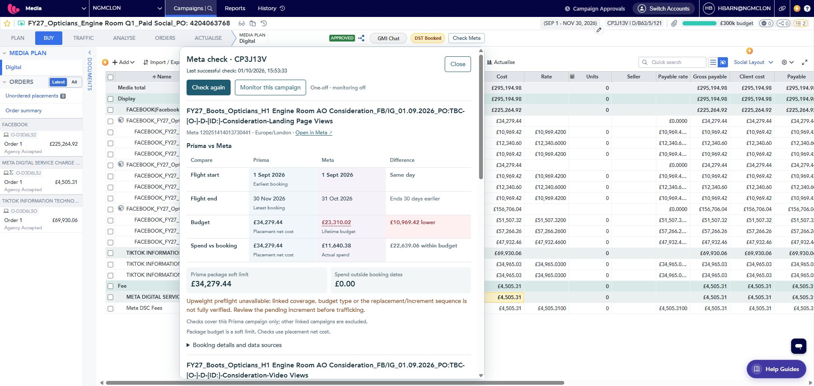
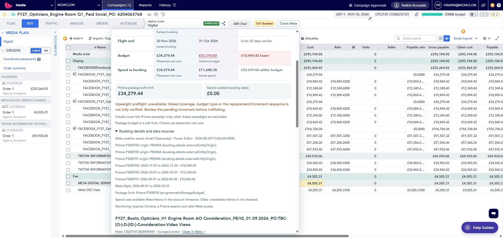
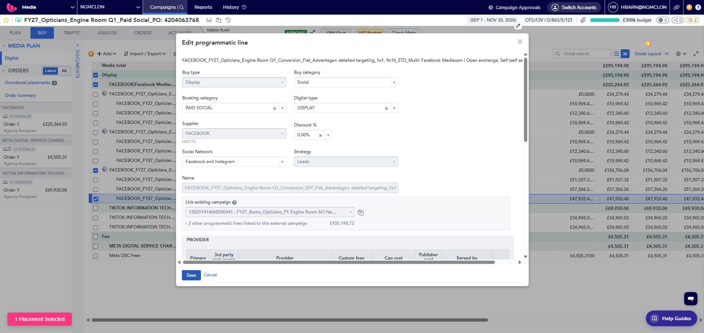

# Check Meta and Social Booking Checker review

Reviewed 1 October 2026 on branch r1.9. Live evidence: signed-in Prisma CP3J13V, Engine Room Q1. Source review: the overlay, live campaign page, background checker, comparison core, report workflow and Meta client. No bookings were saved, monitoring was not enabled, and no feature behaviour was changed.

## Verdict

Check Meta is the right entry point for campaign operations: a button reads saved Prisma bookings and live Meta data, with optional monitoring. The side-by-side comparison is clear for one link. Multiple links, pending upweights and ambiguous evidence need a stronger summary and clearer explanations. Social Booking Checker should reuse that live data infrastructure, while retaining its wider account/month reconciliation and export workflow.

## Captured flow

1. **Open Check Meta and complete a check — working, but dense.** The current CP3J13V check completed at 15:53:33. It returned three Meta campaigns. Only the first comparison fits in the visible panel; subsequent campaigns and footer actions require scrolling. Earlier stale extension context cleared after refreshing Prisma.

   

2. **Expand booking details — working, but too technical.** Booking IDs, dates and costs are available. The display repeats raw origin values and field names. Expanding details scrolls the header and Close control out of view.

   

3. **Inspect native Prisma booking details — readable, useful evidence is underused.** September's conversion booking points to the same Meta campaign as October and November. The native editor reports that the first traffic replaced the Meta budget and later changes increment or decrement it. The editor was cancelled without saving. The screenshot shows the saved link; budget-control wording was read from the current DOM snapshot below this view.

   

4. **Open All campaigns — navigation confirmed; destination not visually audited.** Clicking the overlay button opened a Live campaign checks extension tab. Browser policy limits inspection of extension pages. The live-list and Social Booking Checker interfaces were therefore reviewed in current source, not verified visually in their extension execution context.

## Highest-priority findings

### 1. Explain pending upweights before presenting budget mismatches

The conversion comparison shows Prisma £156,706.04 against Meta £105,198.72, a £51,507.32 shortfall. That difference exactly equals the November placement; Meta equals September plus October. The two consideration campaigns have the same pattern. This numerical pattern suggests future funding, but does not by itself prove the complete traffic state or rule out a manual edit.

The checker detects at least one untrafficked increment and displays “Upweight preflight unavailable”, but does not identify which prerequisite failed. Its projection currently requires complete linked coverage, comparable campaign lifetime budgets, an initial trafficked replacement, and an uninterrupted sequence of subsequent increments with verified details. A generic warning leaves users unable to decide whether the red difference is a problem.

Show: booked total, verified trafficked total, pending amount/effective date and current Meta budget. When verification fails, name the missing fact: unknown traffic state, unsupported budget mode, incomplete links, or unverified starting budget. Keep a discrepancy visible, but distinguish an explained future increment from an unexplained budget mismatch. Never suppress a warning solely because amounts happen to match.

For preflight, show “Meta now + pending increment = projected total”, and flag when this exceeds the verified expected total. Explain first traffic versus later amendments separately; the native Prisma text makes clear these can have different semantics. Any support for increment-only initial bookings needs a verified baseline, not an assumed zero budget.

### 2. Summarise multiple Meta links

Start with a short campaign summary: number of linked Meta campaigns, checked/failed links, material differences and pending changes. Then show one compact row per link, using an understandable placement label such as Conversion / LPV / Video Views. Expand a selected row into the existing comparison. Keep the full Meta name and ID accessible.

Keep Close, refresh status and main actions visible while the result body scrolls. Move repeated scope/package explanations into one shared note. Package soft limits remain informational; actual placement budget differences remain the primary budget check. Colour must remain accompanied by text.

### 3. Surface useful booking evidence, rather than raw field names

The overlay already has linked placement IDs, budgets, dates, package membership and validated integration details. Show placements in date order with columns for booking period, net media amount, traffic state and budget action. Add a read-only route to the Prisma booking where the route can be verified.

Replace repeated `origin: PRISMA (booking-details externalEntityOrigin)` text with a plain explanation only after the enum's meaning is validated. In this live example Prisma says PRISMA while Meta's creation event says Power Editor. These are different evidence sources; the current output must not imply either alone proves who pushed or linked the campaign.

Useful further Prisma investigation: last successful traffic date, last saved amendment, cancelled/rebooked status, order/approval state, owner, client/product and exact monthly allocation. The grid/editor exposes some of this context, but each additional response field and its meaning must be validated before implementation. Approval does not prove traffic succeeded; a planned start date is not necessarily the traffic execution timestamp.

### 4. Show freshness and failures per link

The background implementation saves the new result set only after the full campaign loop succeeds. A failure on one linked campaign can leave the whole panel showing old successful results. Preserve successful fresh links and mark failed links individually, with Prisma and Meta timestamps and an overall incomplete status. Expired credentials should offer an inline Meta access action.

During a refresh, mark retained results as previous results immediately. Add stage/progress text such as “Checking Meta link 2 of 3”; the current generic loading message gives little indication of a lengthy lookup.

### 5. Strengthen recent-delivery and change evidence

The current replacement investigation triggers when total available-history spend is zero. It will not investigate an old linked campaign that once spent but has since stopped. Use recent spend and last delivery date, planned flight and pause/deletion state together. An inactive or ended campaign remains an explanation, not proof of replacement.

Current change detection compares snapshots; its recorded time is detection time, not necessarily the time of the edit. Fetch budget/date activity events as supporting evidence, including actor/app and event time when available. Keep “possibly changed outside Prisma” qualified unless saved Prisma and Meta evidence establishes the relationship. `updated_time` alone cannot identify the changed field.

Candidate discovery currently requires an exact name or a direct source_campaign_id relationship. Broader PO/name/date evidence could help investigation, but must never become an automatic financial match. Keep possible replacements separate until confirmed.

## Additional Meta data worth using

| Addition | Benefit | Current position / limitation |
|---|---|---|
| Delivery status, last spend day, recent spend | Distinguish paused, ended, future or recently stopped campaigns | Status and daily spend are already fetched; most can be surfaced without extra endpoints |
| Budget/date activity history | Explain who/what changed a value and when | Current code only requests a small creation-event window; new event/history parsing needs live validation |
| Delivery issues | Explain a linked campaign that cannot deliver | Meta exposes `issues_info`; test field availability with the current API/token |
| Ad-set-level effective status | Separate an active campaign from paused/problem ad sets | Live snapshot currently requests ad-set status, not effective_status; useful addition |
| Scheduled budget periods | Explain budgets that cannot be compared as one lifetime amount | Current checker recognises scheduling but refuses a simple comparison; investigate readable high_demand_periods details before promising scheduled calculations |

Meta's official SDK exposes actor/app/time and extra_data on activity records, budget-change event types, campaign issues_info and schedule flags. This supports investigating these additions; it does not prove all values are accessible with the current token or contain old/new values for every event.

Sources: [Meta activity fields and event types](https://github.com/facebook/facebook-python-business-sdk/blob/main/facebook_business/adobjects/adactivity.py), [campaign fields](https://github.com/facebook/facebook-python-business-sdk/blob/main/facebook_business/adobjects/campaign.py), [scheduled budget period fields](https://github.com/facebook/facebook-python-business-sdk/blob/main/facebook_business/adobjects/highdemandperiod.py).

## Automating Social Booking Checker

| Workflow | Current capability | Recommended change |
|---|---|---|
| One Prisma campaign | Live booking + Meta check, no CSV required | Keep the header button and improve the summary/preflight |
| Selected remembered campaigns | Live checks page runs individual checks | Add a multi-select “Refresh and reconcile” using saved CP numbers |
| Meta account reporting | API refresh already retrieves campaign/ad-set context and monthly/daily spend, using accounts seeded from an imported report | Seed explicitly selected account IDs from verified Prisma links or direct account entry; remove initial Meta report dependency |
| Prisma booking reporting | Broader checker still requires a valid booking CSV | Reuse the live reader for selected CPs; obtain genuine monthly allocations and workflow fields before treating it as equivalent to the report |
| Whole client/account reconciliation | CSV defines a broader population | Investigate a complete, permission-scoped Prisma campaign search/list source, including pagination and client/product/month filters; validate it before removing CSV fallback |

The key limitation is coverage, not CSV format. Remembered/visited campaigns are not every booking for an account. A live account-wide Meta query matched against a few visited CPs can only say “not found in selected Prisma campaigns”, not “missing from Prisma”. A zero-upload campaign workflow is realistic now; full client reconciliation requires a validated campaign inventory and monthly source data.

A placement's full-flight amount is not a monthly allocation. Do not distribute it evenly or assign it to its start month. Also reconcile the live reader's budgetPayableAmount basis against the report's PLANNED_AMOUNT basis for discounts, fees and currencies before combining the engines. Reuse validated raw source data and financial rules, not only cached UI findings.

Recommended product structure: one Social Booking Checker workspace with **Live Prisma campaigns** as the routine workflow and **Import reports** as the broader/offline fallback. Use the same token, account mappings, comparison labels and evidence model. Keep monitoring explicitly opt-in; a user reconciling another person's campaign should be able to refresh and leave without subscribing.

Chrome monitoring currently runs every 30 minutes for opted-in campaigns, up to 50, and needs Chrome, a valid Prisma session and Meta access. It is not an always-on server monitor. Show the last attempted check, last success and paused/failed health. Before larger batch refreshes, add bounded concurrency, cancellation and account-metadata reuse; do not request maximum daily history for every campaign on every poll when a safe incremental refresh can suffice.

## Suggested implementation order

1. Correct upweight explanations and add a compact multi-link summary, persistent actions and a clear per-link freshness/error state.
2. Surface traffic controls, pending dates, recent delivery and explicit reasons for an unverifiable preflight.
3. Add live selected-campaign reconciliation to Social Booking Checker and remove the initial Meta CSV requirement for verified accounts.
4. Validate Prisma campaign discovery and monthly allocations for client-wide reconciliation; keep report import until coverage is proved.
5. Add Meta activity history and scheduled-budget evidence where readable, without overstating attribution.

## Verification limits

This is a live review of one multi-link Prisma Buy campaign, supported by current source and Meta's official SDK. It is not a complete visual audit of extension pages, Plan/Actualise, mobile widths, access-denied states, all linked-campaign populations or screen-reader behaviour. The overlay has labelled dialog/status elements and focus styling, but keyboard focus order, offscreen focus and host interaction need a dedicated live check. No claim of accessibility compliance is made. No tests were rerun because no feature code changed.
